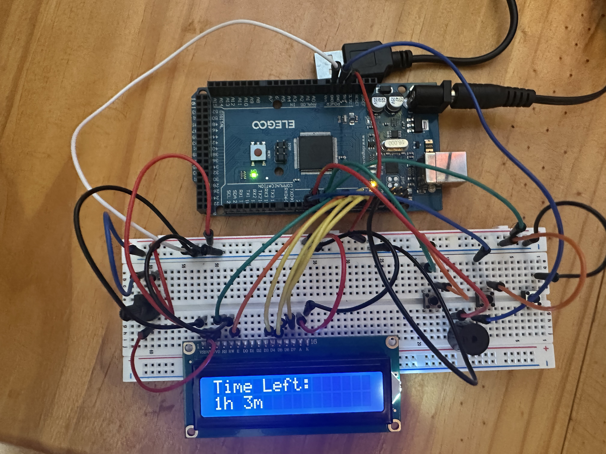

# Arduino Alarm Clock

This project is an Arduino-based alarm clock that allows users to set an alarm using buttons and displays the remaining time on an LCD screen. When the alarm goes off, a buzzer sounds to notify the user. Below are the details of the components used, installation instructions, and cost breakdown.

## Components Used
- **Arduino Mega**: Microcontroller board used to control the alarm clock.
- **I2C LCD Display**: 16x2 LCD screen to display the time and alarm status.
- **Breadboard**: Used for prototyping and connecting components.
- **Potentiometer**: Adjusts the contrast of the LCD display.
- **Buzzer**: Sounds an alarm when the timer reaches zero.
- **Push Buttons**: Used to set hours, minutes, and confirm the alarm.
- **Jumper Cables**: Connect components on the breadboard.

## Cost Breakdown
| Component         | Approximate Cost |
|-------------------|------------------|
| Arduino Mega      | $25             |
| I2C LCD Display   | $10             |
| Breadboard        | $5              |
| Potentiometer     | $2              |
| Buzzer            | $3              |
| Push Buttons (x3) | $1 each         |
| Jumper Cables     | $5              |

**Total Cost**: ~$52

## Installation Instructions for Arduino IDE
1. **Download Arduino IDE**:
   - Visit the [Arduino IDE download page](https://www.arduino.cc/en/software).
   - Download the version compatible with your operating system (Windows, macOS, or Linux).

2. **Install Arduino IDE**:
   - Follow the installation instructions provided on the download page.
   - Launch the Arduino IDE after installation.

3. **Install Required Libraries**:
   - Open the Arduino IDE.
   - Go to `Sketch > Include Library > Manage Libraries`.
   - Search for `LiquidCrystal` and install it.

4. **Connect the Arduino Mega**:
   - Use a USB cable to connect the Arduino Mega to your computer.
   - Ensure the correct port is selected in `Tools > Port`.

5. **Upload the Code**:
   - Copy the code from `main.cpp` into the Arduino IDE.
   - Click the upload button to flash the code onto the Arduino Mega.

6. **Assemble the Circuit**:
   - Refer to the images provided for wiring the components:
     - Connect the LCD display to the Arduino using I2C pins.
     - Wire the buttons to the respective pins (`3`, `5`, `6`).
     - Connect the buzzer to pin `4`.
     - Use the potentiometer to adjust the LCD contrast.

## Photos
Below are photos of the assembled project:

### Full Setup

### Breadboard Close-Up

## Usage
1. Use the buttons to set the hours and minutes.
2. Press the confirm button to set the alarm.
3. The LCD will display the remaining time until the alarm goes off.
4. When the timer reaches zero, the buzzer will sound.

Enjoy your Arduino Alarm Clock!
